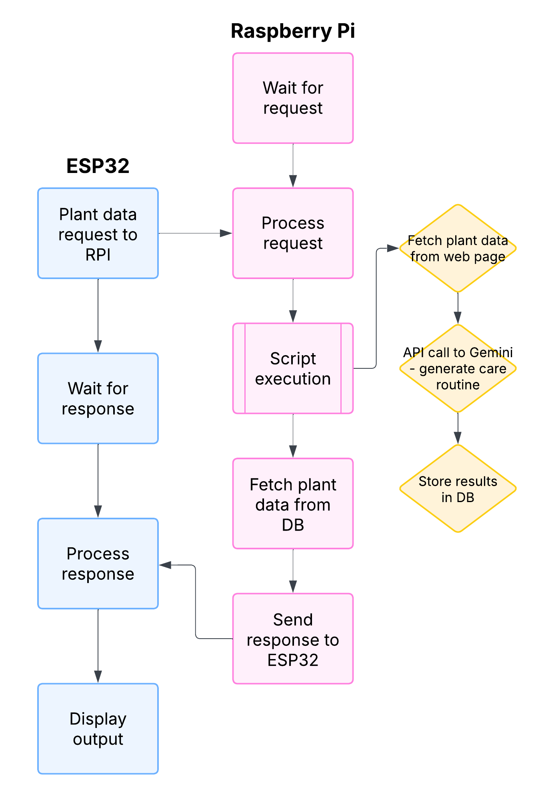

# PlantCare Monitor 🌱

## About

This project integrates with the Greg mobile app by Gregarious, Inc. The goal of this project is to create an external device to display individual watering statuses for a user's plants. An ESP32 will control the external display but will offload the expensive API calls and data storage to a Raspberry Pi. The Raspberry Pi will then send a response with the appropriate data for display, and the ESP32 controller will update the display accordingly. For a logical diagram of this workflow, see ["Workflow"](#workflow) section below.

## Workflow

